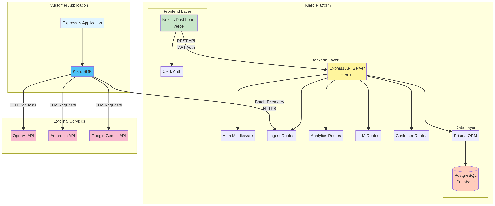
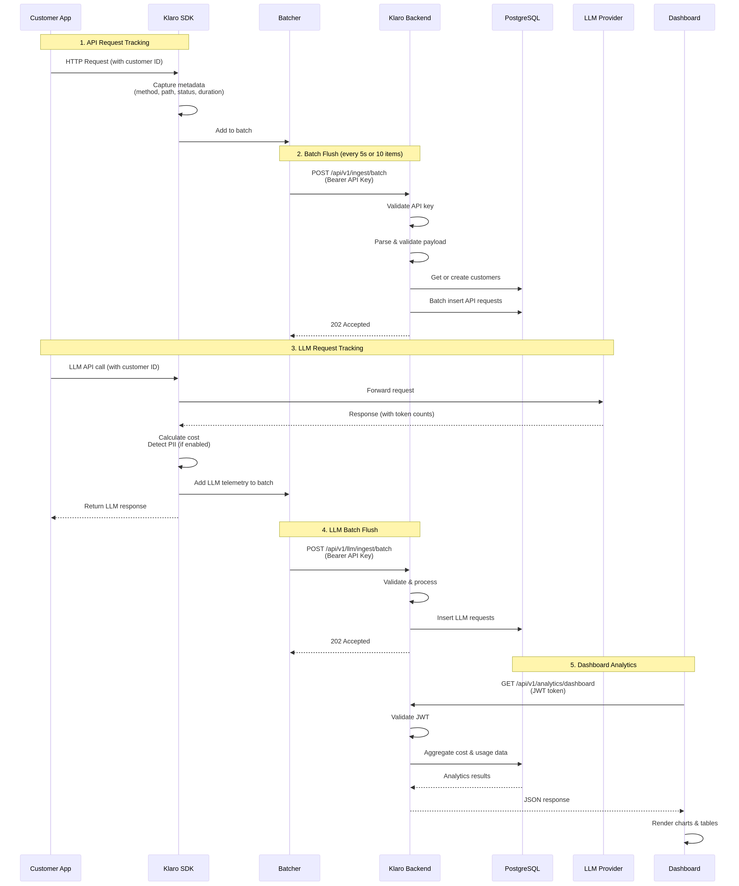
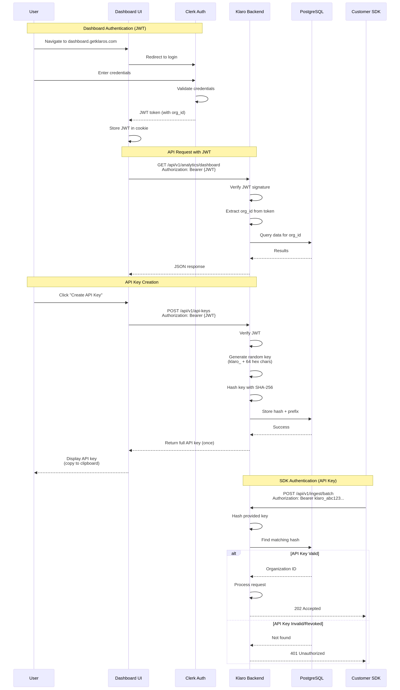

# Klaro Technical Documentation

**Version**: 1.0.0  
**Last Updated**: November 16, 2025  
**Author**: Klaro Team

---

## Table of Contents

1. [Architecture Overview](#architecture-overview)
2. [System Components](#system-components)
3. [API Reference](#api-reference)
4. [SDK Reference](#sdk-reference)
5. [Data Models](#data-models)
6. [Authentication & Security](#authentication--security)
7. [Performance & Scalability](#performance--scalability)
8. [Error Handling](#error-handling)

---

## Architecture Overview

Klaro is a **cost tracking platform** designed for AI SaaS companies to monitor and attribute infrastructure costs (API requests, LLM usage, cloud resources) to individual customers. The system follows a **three-tier architecture** with clear separation of concerns.

### High-Level Architecture

The Klaro platform consists of three main layers that work together to provide comprehensive cost tracking and analytics capabilities.



*Figure 1: Klaro System Architecture - Three-tier architecture with Frontend (Vercel), Backend (Heroku), and SDK layers*

**Frontend Layer** serves as the user interface, built with Next.js 15 and deployed on Vercel. This layer provides real-time dashboards, cost visualizations, and customer management interfaces. The frontend communicates with the backend through a RESTful API and handles user authentication via Clerk.

**Backend Layer** acts as the core processing engine, implemented in Node.js with Express and TypeScript, deployed on Heroku. This layer processes incoming telemetry data from the SDK, performs cost calculations, detects PII in LLM responses, and serves aggregated analytics. The backend enforces authentication, rate limiting, and data validation for all incoming requests.

**SDK Layer** integrates directly into customer applications, providing middleware for Express.js and wrappers for popular LLM providers (OpenAI, Anthropic, Google Gemini). The SDK captures request metadata, calculates token usage, and batches telemetry data before sending it to the backend asynchronously to minimize performance impact.

### Data Flow

The typical data flow through the Klaro system follows a well-defined path from SDK instrumentation to dashboard visualization.



*Figure 2: Klaro Data Flow - Sequence diagram showing request tracking, batching, and analytics flow*

When a customer makes an API request or LLM call in an instrumented application, the Klaro SDK intercepts the request and captures relevant metadata including customer ID, endpoint, duration, status code, and for LLM requests, token counts and model information. This data is batched locally in memory to reduce network overhead.

Periodically (default every 5 seconds or when batch size reaches 10 items), the SDK flushes the batch to the Klaro backend via the `/api/v1/ingest/batch` endpoint. The backend authenticates the request using the provided API key, validates the payload schema, and processes each request in the batch.

For each request, the backend either retrieves or creates a customer record based on the external customer ID, then inserts the telemetry data into PostgreSQL. For LLM requests, the backend also performs PII detection by scanning the response text for sensitive patterns (emails, phone numbers, SSNs, credit cards, etc.) and stores the detected categories.

The frontend periodically queries the backend for aggregated analytics, which are computed on-demand using SQL aggregations over the telemetry data. The dashboard displays cost breakdowns by customer, provider, model, and time period, along with PII detection statistics and request volume metrics.

### Technology Stack

The Klaro platform leverages modern, production-ready technologies chosen for their reliability, developer experience, and ecosystem maturity.

| Component | Technology | Purpose |
|-----------|-----------|---------|
| **Frontend** | Next.js 15, React 19, TypeScript | Server-side rendering, routing, type safety |
| **UI Library** | Tailwind CSS, shadcn/ui, Recharts | Styling, components, data visualization |
| **Backend** | Node.js 22, Express 4, TypeScript | API server, request handling, business logic |
| **Database** | PostgreSQL 15 (Supabase) | Relational data storage, analytics queries |
| **ORM** | Prisma 6 | Type-safe database access, migrations |
| **Authentication** | Clerk | User authentication, organization management |
| **SDK** | TypeScript, OpenAI SDK, Anthropic SDK, Google Generative AI SDK | Client instrumentation, LLM wrappers |
| **Deployment** | Vercel (frontend), Heroku (backend) | Hosting, CI/CD, scaling |
| **Monitoring** | Heroku Logs, Vercel Analytics | Error tracking, performance monitoring |

---

## System Components

### Backend API Server

The backend API server is the central component of the Klaro platform, responsible for ingesting telemetry data, performing analytics calculations, and serving the frontend dashboard.

**Core Responsibilities** include authenticating API requests using JWT tokens or API keys, validating incoming payloads against Zod schemas, processing telemetry data from the SDK, detecting PII in LLM responses, aggregating cost and usage metrics, and serving RESTful API endpoints for the frontend.

**Key Features** implemented in the backend include automatic customer creation when a new external ID is encountered, batch ingestion support for up to 100 requests per batch to improve throughput, PII detection using regex patterns for common sensitive data types, cost calculation based on token usage and model pricing, and comprehensive error handling with structured logging.

**Deployment Configuration** runs on Heroku Eco Dynos with automatic SSL, environment-based configuration via environment variables, PostgreSQL connection pooling for optimal database performance, and CORS enabled for the frontend domain to allow cross-origin requests.

### Frontend Dashboard

The frontend dashboard provides a comprehensive interface for visualizing cost data, managing customers, and analyzing LLM usage patterns.

**Core Features** include a dashboard overview with summary cards showing total costs, request counts, PII detection rates, and active customer counts. The customer management interface allows viewing and filtering customers with detailed cost breakdowns per customer. The LLM costs page provides detailed request analysis with filters by provider, model, customer, and PII detection status, along with PII breakdown charts and prompt/response viewers.

**Technical Implementation** uses Next.js App Router for file-based routing and server components, Clerk for authentication with organization-based access control, Recharts for interactive data visualizations including bar charts, line charts, and pie charts, and Tailwind CSS with shadcn/ui for consistent, accessible UI components.

**Performance Optimizations** include server-side rendering for initial page loads to improve perceived performance, client-side data fetching with React Query for caching and automatic refetching, pagination for large datasets to reduce payload sizes, and responsive design for mobile and desktop viewing.

### SDK Client Library

The Klaro SDK is a TypeScript library that integrates into customer applications to capture telemetry data with minimal performance impact.

**Middleware Component** provides Express.js middleware (`klaroMiddleware`) that automatically tracks all API requests passing through the application. The middleware extracts customer ID using a user-provided function, captures request metadata including method, path, status code, duration, headers, and query parameters, batches requests in memory before sending to reduce network calls, and skips specified paths like health checks to avoid noise.

**LLM Wrappers** offer drop-in replacements for popular LLM SDKs including `KlaroOpenAI` for OpenAI GPT models, `KlaroClaude` for Anthropic Claude models, and `KlaroGemini` for Google Gemini models. These wrappers maintain the same API as the original SDKs while adding automatic token counting and cost calculation, PII detection in responses when enabled, customer ID association for cost attribution, and asynchronous telemetry submission to avoid blocking the main thread.

**Batching System** implements an efficient batching mechanism with configurable batch size (default 10 requests) and flush interval (default 5 seconds). The batcher automatically flushes on application shutdown to prevent data loss, retries failed submissions with exponential backoff, and provides error callbacks for monitoring and alerting.

---

## API Reference

### Base URL

**Production**: `https://klaro-backend-8864a43dffbd.herokuapp.com`  
**API Version**: `v1`  
**Base Path**: `/api/v1`

All API endpoints require authentication via API key or JWT token in the `Authorization` header.

### Authentication

Klaro supports two authentication methods depending on the use case.

**API Key Authentication** is used by the SDK for programmatic access. API keys are prefixed with `klaro_` followed by 32 hexadecimal characters (e.g., `klaro_a1b2c3d4e5f6...`). To authenticate, include the API key in the `Authorization` header as `Bearer klaro_a1b2c3d4e5f6...`. API keys are hashed using SHA-256 before storage and are scoped to a single organization.

**JWT Authentication** is used by the frontend dashboard for user sessions. Clerk issues JWT tokens upon successful login, which are automatically included in requests by the frontend. The backend validates JWT signatures and extracts the organization ID from the token payload. JWT tokens expire after 1 hour and are automatically refreshed by Clerk.

### Endpoints

#### Health Check

**GET** `/health`

Returns the health status of the API server and database connection.

**Authentication**: None required

**Response** (200 OK):
```json
{
  "status": "ok",
  "timestamp": "2025-11-16T10:30:00.000Z",
  "uptime": 3600,
  "environment": "production"
}
```

**Response** (503 Service Unavailable):
```json
{
  "status": "error",
  "message": "Database connection failed"
}
```

---

#### Ingest API Request

**POST** `/api/v1/ingest`

Ingests a single API request telemetry record.

**Authentication**: API Key (Bearer token)

**Request Body**:
```json
{
  "customerId": "string (min 1 char, required)",
  "path": "string (min 1 char, required)",
  "method": "string (min 1 char, required)",
  "statusCode": "number (required)",
  "duration": "number (milliseconds, required)",
  "headers": "object (optional)",
  "query": "object (optional)",
  "timestamp": "string (ISO 8601 datetime, required)"
}
```

**Example Request**:
```json
{
  "customerId": "customer_123",
  "path": "/api/users",
  "method": "GET",
  "statusCode": 200,
  "duration": 45,
  "headers": {
    "user-agent": "Mozilla/5.0..."
  },
  "query": {
    "page": "1",
    "limit": "10"
  },
  "timestamp": "2025-11-16T10:30:00.000Z"
}
```

**Response** (202 Accepted):
```json
{
  "success": true
}
```

**Behavior**: If the customer with the provided `customerId` (external ID) does not exist, the backend automatically creates a new customer record with the external ID as the name.

---

#### Batch Ingest API Requests

**POST** `/api/v1/ingest/batch`

Ingests multiple API request telemetry records in a single request.

**Authentication**: API Key (Bearer token)

**Request Body**:
```json
{
  "requests": [
    {
      "customerId": "string (required)",
      "path": "string (required)",
      "method": "string (required)",
      "statusCode": "number (required)",
      "duration": "number (milliseconds, required)",
      "headers": "object (optional)",
      "query": "object (optional)",
      "timestamp": "string (ISO 8601 datetime, required)"
    }
  ]
}
```

**Constraints**:
- Maximum 100 requests per batch
- All requests must belong to the same organization (determined by API key)

**Example Request**:
```json
{
  "requests": [
    {
      "customerId": "customer_123",
      "path": "/api/users",
      "method": "GET",
      "statusCode": 200,
      "duration": 45,
      "timestamp": "2025-11-16T10:30:00.000Z"
    },
    {
      "customerId": "customer_456",
      "path": "/api/products",
      "method": "POST",
      "statusCode": 201,
      "duration": 120,
      "timestamp": "2025-11-16T10:30:05.000Z"
    }
  ]
}
```

**Response** (202 Accepted):
```json
{
  "success": true,
  "processed": 2
}
```

**Behavior**: The backend automatically creates missing customers and uses database transactions to ensure atomicity.

---

#### Get Dashboard Analytics

**GET** `/api/v1/analytics/dashboard`

Returns aggregated analytics for the dashboard overview.

**Authentication**: JWT (Clerk token)

**Query Parameters**:
- `startDate` (optional): ISO 8601 datetime string for filtering data from this date
- `endDate` (optional): ISO 8601 datetime string for filtering data until this date

**Example Request**:
```
GET /api/v1/analytics/dashboard?startDate=2025-11-01T00:00:00.000Z&endDate=2025-11-16T23:59:59.999Z
```

**Response** (200 OK):
```json
{
  "totalApiCost": 0,
  "totalLlmCost": 1.7381,
  "totalRequests": 25,
  "totalTokens": 85070,
  "inputTokens": 57700,
  "outputTokens": 27370,
  "activeCustomers": 3,
  "piiDetected": 25,
  "piiPercentage": 100.0,
  "costByCustomer": [
    {
      "customerId": "uuid",
      "customerName": "Acme Corp",
      "externalId": "customer_acme",
      "requestCount": 14,
      "totalCost": 0.8894
    },
    {
      "customerId": "uuid",
      "customerName": "DataFlow LLC",
      "externalId": "customer_dataflow",
      "requestCount": 6,
      "totalCost": 0.575
    },
    {
      "customerId": "uuid",
      "customerName": "TechStart Inc",
      "externalId": "customer_techstart",
      "requestCount": 5,
      "totalCost": 0.27375
    }
  ]
}
```

---

#### Get Customers List

**GET** `/api/v1/customers`

Returns a list of customers for the authenticated organization.

**Authentication**: JWT (Clerk token)

**Query Parameters**:
- `page` (optional, default: 1): Page number for pagination
- `limit` (optional, default: 20): Number of customers per page
- `search` (optional): Search query to filter customers by name or external ID

**Example Request**:
```
GET /api/v1/customers?page=1&limit=20&search=acme
```

**Response** (200 OK):
```json
{
  "customers": [
    {
      "id": "uuid",
      "name": "Acme Corp",
      "externalId": "customer_acme",
      "createdAt": "2025-11-15T10:00:00.000Z",
      "totalCost": 0.8894,
      "requestCount": 14,
      "lastRequestAt": "2025-11-16T10:30:00.000Z"
    }
  ],
  "pagination": {
    "page": 1,
    "limit": 20,
    "total": 1,
    "totalPages": 1
  }
}
```

---

#### Get LLM Requests

**GET** `/api/v1/llm/requests`

Returns a paginated list of LLM requests with detailed metadata.

**Authentication**: JWT (Clerk token)

**Query Parameters**:
- `page` (optional, default: 1): Page number for pagination
- `limit` (optional, default: 20): Number of requests per page
- `provider` (optional): Filter by provider (e.g., "openai", "anthropic", "google", "cohere")
- `model` (optional): Filter by model name (e.g., "gpt-4", "claude-3-opus")
- `customerId` (optional): Filter by customer UUID
- `piiDetected` (optional, boolean): Filter by PII detection status
- `search` (optional): Search in prompts and responses
- `startDate` (optional): ISO 8601 datetime string for filtering from this date
- `endDate` (optional): ISO 8601 datetime string for filtering until this date

**Example Request**:
```
GET /api/v1/llm/requests?page=1&limit=20&provider=openai&piiDetected=true
```

**Response** (200 OK):
```json
{
  "requests": [
    {
      "id": "uuid",
      "provider": "openai",
      "model": "gpt-4",
      "prompt": "Analyze this customer data...",
      "response": "Based on the data provided...",
      "inputTokens": 1500,
      "outputTokens": 800,
      "totalTokens": 2300,
      "cost": 0.069,
      "latencyMs": 2100,
      "status": "success",
      "piiDetected": true,
      "piiCategories": ["email", "phone", "address"],
      "piiCount": 5,
      "customerId": "uuid",
      "customerName": "Acme Corp",
      "timestamp": "2025-11-16T10:30:00.000Z"
    }
  ],
  "pagination": {
    "page": 1,
    "limit": 20,
    "total": 25,
    "totalPages": 2
  },
  "summary": {
    "totalCost": 1.7381,
    "totalRequests": 25,
    "piiDetected": 25,
    "avgLatency": 1723
  }
}
```

---

#### Get API Keys

**GET** `/api/v1/api-keys`

Returns a list of API keys for the authenticated organization.

**Authentication**: JWT (Clerk token)

**Response** (200 OK):
```json
{
  "apiKeys": [
    {
      "id": "uuid",
      "name": "Production API Key",
      "keyPrefix": "klaro_a1b2c3d4",
      "createdAt": "2025-11-15T10:00:00.000Z",
      "lastUsedAt": "2025-11-16T10:30:00.000Z",
      "revokedAt": null
    }
  ]
}
```

**Note**: Full API keys are only shown once during creation and are never returned in subsequent requests.

---

#### Create API Key

**POST** `/api/v1/api-keys`

Creates a new API key for the authenticated organization.

**Authentication**: JWT (Clerk token)

**Request Body**:
```json
{
  "name": "string (optional, default: 'API Key')"
}
```

**Response** (201 Created):
```json
{
  "id": "uuid",
  "name": "Production API Key",
  "apiKey": "klaro_a1b2c3d4e5f6...",
  "createdAt": "2025-11-16T10:30:00.000Z"
}
```

**Warning**: The `apiKey` field contains the full API key and is only returned once. Store it securely as it cannot be retrieved later.

---

#### Revoke API Key

**DELETE** `/api/v1/api-keys/:id`

Revokes an API key (soft delete).

**Authentication**: JWT (Clerk token)

**Path Parameters**:
- `id`: UUID of the API key to revoke

**Response** (200 OK):
```json
{
  "success": true
}
```

**Behavior**: The API key is soft-deleted by setting `revokedAt` timestamp. It can no longer be used for authentication but remains in the database for audit purposes.

---

## SDK Reference

### Installation

The Klaro SDK is published on npm and can be installed using any Node.js package manager.

```bash
npm install @klaro/sdk
# or
yarn add @klaro/sdk
# or
pnpm add @klaro/sdk
```

**Requirements**:
- Node.js 18 or higher
- TypeScript 5.0 or higher (optional but recommended)

---

### Express Middleware

The `klaroMiddleware` function creates Express middleware that automatically tracks all API requests passing through your application.

#### Configuration

```typescript
import { klaroMiddleware, KlaroMiddlewareConfig } from '@klaro/sdk';

interface KlaroMiddlewareConfig {
  apiKey: string;
  getCustomerId: (req: Request) => string | undefined;
  apiUrl?: string;
  enableBatching?: boolean;
  maxBatchSize?: number;
  flushInterval?: number;
  captureHeaders?: boolean;
  captureQuery?: boolean;
  skipPaths?: string[];
}
```

| Option | Type | Required | Default | Description |
|--------|------|----------|---------|-------------|
| `apiKey` | `string` | Yes | - | Your Klaro API key (starts with `klaro_`) |
| `getCustomerId` | `(req) => string \| undefined` | Yes | - | Function to extract customer ID from request |
| `apiUrl` | `string` | No | `https://klaro-backend-8864a43dffbd.herokuapp.com` | Klaro API base URL |
| `enableBatching` | `boolean` | No | `true` | Enable request batching to reduce network calls |
| `maxBatchSize` | `number` | No | `10` | Maximum number of requests per batch |
| `flushInterval` | `number` | No | `5000` | Flush interval in milliseconds |
| `captureHeaders` | `boolean` | No | `false` | Capture request headers in metadata |
| `captureQuery` | `boolean` | No | `true` | Capture query parameters in metadata |
| `skipPaths` | `string[]` | No | `[]` | Array of paths to skip tracking (e.g., `/health`) |

#### Usage Example

```typescript
import express from 'express';
import { klaroMiddleware } from '@klaro/sdk';

const app = express();

app.use(klaroMiddleware({
  apiKey: process.env.KLARO_API_KEY!,
  getCustomerId: (req) => {
    // Extract customer ID from JWT token
    const token = req.headers.authorization?.split(' ')[1];
    if (!token) return undefined;
    
    try {
      const decoded = jwt.verify(token, process.env.JWT_SECRET!);
      return decoded.userId;
    } catch {
      return undefined;
    }
  },
  skipPaths: ['/health', '/metrics', '/favicon.ico']
}));

// Your routes...
app.get('/api/users', (req, res) => {
  res.json({ users: [] });
});

app.listen(3000);
```

#### Behavior

The middleware intercepts every request that passes through the Express app and captures the following metadata: HTTP method, request path, status code, response time in milliseconds, timestamp, and optionally headers and query parameters. If `getCustomerId` returns `undefined`, the request is not tracked. The middleware operates asynchronously and does not block the request-response cycle. Captured data is batched in memory and flushed periodically to the Klaro backend. On application shutdown, the middleware automatically flushes any pending batches to prevent data loss.

---

### OpenAI Wrapper

The `KlaroOpenAI` class is a drop-in replacement for the OpenAI SDK that adds automatic cost tracking and PII detection.

#### Configuration

```typescript
import { KlaroOpenAI, KlaroOpenAIConfig } from '@klaro/sdk';

interface KlaroOpenAIConfig {
  klaroApiKey: string;
  openaiApiKey: string;
  klaroApiUrl?: string;
  enablePIIDetection?: boolean;
}
```

| Option | Type | Required | Default | Description |
|--------|------|----------|---------|-------------|
| `klaroApiKey` | `string` | Yes | - | Your Klaro API key |
| `openaiApiKey` | `string` | Yes | - | Your OpenAI API key |
| `klaroApiUrl` | `string` | No | `https://klaro-backend-8864a43dffbd.herokuapp.com` | Klaro API base URL |
| `enablePIIDetection` | `boolean` | No | `false` | Enable PII detection in responses |

#### Usage Example

```typescript
import { KlaroOpenAI } from '@klaro/sdk';

const klaro = new KlaroOpenAI({
  klaroApiKey: process.env.KLARO_API_KEY!,
  openaiApiKey: process.env.OPENAI_API_KEY!,
  enablePIIDetection: true
});

// Use like normal OpenAI SDK, but pass customerId
const response = await klaro.chat.completions.create({
  customerId: 'customer_123', // Required for cost attribution
  model: 'gpt-4',
  messages: [
    { role: 'system', content: 'You are a helpful assistant.' },
    { role: 'user', content: 'What is the capital of France?' }
  ]
});

console.log(response.choices[0].message.content);
```

#### Supported Models

The wrapper supports all OpenAI chat completion models and automatically calculates costs based on the official pricing:

| Model | Input Cost (per 1K tokens) | Output Cost (per 1K tokens) |
|-------|----------------------------|----------------------------|
| `gpt-4` | $0.03 | $0.06 |
| `gpt-4-32k` | $0.06 | $0.12 |
| `gpt-4-turbo` | $0.01 | $0.03 |
| `gpt-3.5-turbo` | $0.0015 | $0.002 |
| `gpt-3.5-turbo-16k` | $0.003 | $0.004 |

#### Behavior

The wrapper intercepts `chat.completions.create` calls and wraps the OpenAI SDK to capture token usage from the response. It calculates cost based on input/output tokens and model pricing, detects PII in the response content if enabled, and sends telemetry data asynchronously to Klaro backend. The wrapper returns the original OpenAI response unchanged, ensuring compatibility with existing code.

---

### Claude Wrapper

The `KlaroClaude` class provides the same functionality as `KlaroOpenAI` but for Anthropic's Claude models.

#### Configuration

```typescript
import { KlaroClaude, KlaroClaudeConfig } from '@klaro/sdk';

interface KlaroClaudeConfig {
  klaroApiKey: string;
  anthropicApiKey: string;
  klaroApiUrl?: string;
  enablePIIDetection?: boolean;
}
```

#### Usage Example

```typescript
import { KlaroClaude } from '@klaro/sdk';

const klaro = new KlaroClaude({
  klaroApiKey: process.env.KLARO_API_KEY!,
  anthropicApiKey: process.env.ANTHROPIC_API_KEY!,
  enablePIIDetection: true
});

const response = await klaro.messages.create({
  customerId: 'customer_123',
  model: 'claude-3-opus-20240229',
  max_tokens: 1024,
  messages: [
    { role: 'user', content: 'What is the capital of France?' }
  ]
});

console.log(response.content[0].text);
```

#### Supported Models

| Model | Input Cost (per 1K tokens) | Output Cost (per 1K tokens) |
|-------|----------------------------|----------------------------|
| `claude-3-opus-20240229` | $0.015 | $0.075 |
| `claude-3-sonnet-20240229` | $0.003 | $0.015 |
| `claude-3-haiku-20240307` | $0.00025 | $0.00125 |

---

### Gemini Wrapper

The `KlaroGemini` class provides cost tracking for Google's Gemini models.

#### Configuration

```typescript
import { KlaroGemini, KlaroGeminiConfig } from '@klaro/sdk';

interface KlaroGeminiConfig {
  klaroApiKey: string;
  googleApiKey: string;
  klaroApiUrl?: string;
  enablePIIDetection?: boolean;
}
```

#### Usage Example

```typescript
import { KlaroGemini } from '@klaro/sdk';

const klaro = new KlaroGemini({
  klaroApiKey: process.env.KLARO_API_KEY!,
  googleApiKey: process.env.GOOGLE_API_KEY!,
  enablePIIDetection: true
});

const response = await klaro.generateContent({
  customerId: 'customer_123',
  model: 'gemini-pro',
  prompt: 'What is the capital of France?'
});

console.log(response.text);
```

#### Supported Models

| Model | Input Cost (per 1K tokens) | Output Cost (per 1K tokens) |
|-------|----------------------------|----------------------------|
| `gemini-pro` | $0.00025 | $0.0005 |
| `gemini-pro-vision` | $0.00025 | $0.0005 |

---

### Batching System

The SDK includes an efficient batching system that reduces network overhead by grouping multiple telemetry records into a single HTTP request.

#### How It Works

When telemetry data is captured (either from middleware or LLM wrappers), it is added to an in-memory batch instead of being sent immediately. The batch is flushed to the Klaro backend when either the batch size reaches `maxBatchSize` (default 10) or the flush interval timer expires (default 5 seconds), whichever comes first. On application shutdown, the batcher automatically flushes any pending data to prevent loss.

#### Configuration

```typescript
import { Batcher, BatcherConfig } from '@klaro/sdk';

interface BatcherConfig {
  apiKey: string;
  apiUrl: string;
  maxBatchSize: number;
  flushInterval: number;
  onError?: (error: Error) => void;
}
```

#### Manual Batching

For advanced use cases, you can use the `Batcher` class directly:

```typescript
import { Batcher } from '@klaro/sdk';

const batcher = new Batcher({
  apiKey: process.env.KLARO_API_KEY!,
  apiUrl: 'https://klaro-backend-8864a43dffbd.herokuapp.com',
  maxBatchSize: 20,
  flushInterval: 10000,
  onError: (error) => {
    console.error('Klaro batch failed:', error);
  }
});

// Add items to batch
batcher.add({
  customerId: 'customer_123',
  path: '/api/users',
  method: 'GET',
  statusCode: 200,
  duration: 45,
  timestamp: new Date().toISOString()
});

// Force flush
await batcher.flush();

// Cleanup
await batcher.close();
```

---

## Data Models

### Database Schema

Klaro uses PostgreSQL with Prisma ORM for type-safe database access. The schema is designed for efficient querying and analytics.

#### Organizations

Represents a company or team using Klaro.

```prisma
model Organization {
  id          String   @id @default(uuid())
  clerkOrgId  String   @unique
  name        String
  createdAt   DateTime @default(now())
  updatedAt   DateTime @updatedAt
  
  customers   Customer[]
  apiKeys     ApiKey[]
  apiRequests ApiRequest[]
  llmRequests LlmRequest[]
}
```

| Field | Type | Description |
|-------|------|-------------|
| `id` | UUID | Primary key |
| `clerkOrgId` | String | Clerk organization ID (unique) |
| `name` | String | Organization name |
| `createdAt` | DateTime | Creation timestamp |
| `updatedAt` | DateTime | Last update timestamp |

---

#### Customers

Represents an end customer of the organization.

```prisma
model Customer {
  id             String   @id @default(uuid())
  organizationId String
  externalId     String
  name           String
  createdAt      DateTime @default(now())
  updatedAt      DateTime @updatedAt
  
  organization   Organization @relation(fields: [organizationId], references: [id])
  apiRequests    ApiRequest[]
  llmRequests    LlmRequest[]
  
  @@unique([organizationId, externalId])
  @@index([organizationId])
}
```

| Field | Type | Description |
|-------|------|-------------|
| `id` | UUID | Primary key |
| `organizationId` | UUID | Foreign key to Organization |
| `externalId` | String | Customer ID from the organization's system |
| `name` | String | Customer display name |
| `createdAt` | DateTime | Creation timestamp |
| `updatedAt` | DateTime | Last update timestamp |

**Unique Constraint**: `(organizationId, externalId)` ensures each organization can only have one customer with a given external ID.

---

#### API Requests

Represents a single API request tracked by the middleware.

```prisma
model ApiRequest {
  id             String   @id @default(uuid())
  organizationId String
  customerId     String
  endpoint       String
  method         String
  statusCode     Int
  durationMs     Int
  metadata       Json?
  timestamp      DateTime
  createdAt      DateTime @default(now())
  
  organization   Organization @relation(fields: [organizationId], references: [id])
  customer       Customer     @relation(fields: [customerId], references: [id])
  
  @@index([organizationId, timestamp])
  @@index([customerId, timestamp])
}
```

| Field | Type | Description |
|-------|------|-------------|
| `id` | UUID | Primary key |
| `organizationId` | UUID | Foreign key to Organization |
| `customerId` | UUID | Foreign key to Customer |
| `endpoint` | String | Request path (e.g., `/api/users`) |
| `method` | String | HTTP method (e.g., `GET`, `POST`) |
| `statusCode` | Int | HTTP status code (e.g., 200, 404) |
| `durationMs` | Int | Response time in milliseconds |
| `metadata` | JSON | Optional metadata (headers, query params) |
| `timestamp` | DateTime | Request timestamp |
| `createdAt` | DateTime | Record creation timestamp |

**Indexes**: `(organizationId, timestamp)` and `(customerId, timestamp)` for efficient time-range queries.

---

#### LLM Requests

Represents a single LLM API call tracked by the SDK wrappers.

```prisma
model LlmRequest {
  id             String   @id @default(uuid())
  organizationId String
  customerId     String
  provider       String
  model          String
  prompt         String   @db.Text
  response       String   @db.Text
  inputTokens    Int
  outputTokens   Int
  totalTokens    Int
  cost           Decimal  @db.Decimal(10, 6)
  latencyMs      Int
  status         String
  piiDetected    Boolean  @default(false)
  piiCategories  String[]
  piiCount       Int      @default(0)
  timestamp      DateTime
  createdAt      DateTime @default(now())
  
  organization   Organization @relation(fields: [organizationId], references: [id])
  customer       Customer     @relation(fields: [customerId], references: [id])
  
  @@index([organizationId, timestamp])
  @@index([customerId, timestamp])
  @@index([provider, model])
}
```

| Field | Type | Description |
|-------|------|-------------|
| `id` | UUID | Primary key |
| `organizationId` | UUID | Foreign key to Organization |
| `customerId` | UUID | Foreign key to Customer |
| `provider` | String | LLM provider (e.g., `openai`, `anthropic`, `google`) |
| `model` | String | Model name (e.g., `gpt-4`, `claude-3-opus`) |
| `prompt` | Text | User prompt sent to LLM |
| `response` | Text | LLM response text |
| `inputTokens` | Int | Number of input tokens |
| `outputTokens` | Int | Number of output tokens |
| `totalTokens` | Int | Total tokens (input + output) |
| `cost` | Decimal | Calculated cost in USD (6 decimal places) |
| `latencyMs` | Int | Response time in milliseconds |
| `status` | String | Request status (`success`, `error`) |
| `piiDetected` | Boolean | Whether PII was detected in response |
| `piiCategories` | String[] | Array of detected PII types |
| `piiCount` | Int | Number of PII instances detected |
| `timestamp` | DateTime | Request timestamp |
| `createdAt` | DateTime | Record creation timestamp |

**Indexes**: `(organizationId, timestamp)`, `(customerId, timestamp)`, and `(provider, model)` for efficient filtering and analytics.

---

#### API Keys

Represents an API key for SDK authentication.

```prisma
model ApiKey {
  id             String    @id @default(uuid())
  organizationId String
  name           String    @default("API Key")
  keyHash        String    @unique
  keyPrefix      String
  lastUsedAt     DateTime?
  revokedAt      DateTime?
  createdAt      DateTime  @default(now())
  
  organization   Organization @relation(fields: [organizationId], references: [id])
  
  @@index([organizationId])
}
```

| Field | Type | Description |
|-------|------|-------------|
| `id` | UUID | Primary key |
| `organizationId` | UUID | Foreign key to Organization |
| `name` | String | User-defined name for the key |
| `keyHash` | String | SHA-256 hash of the full API key |
| `keyPrefix` | String | First 8 characters of the key for display |
| `lastUsedAt` | DateTime | Last time the key was used |
| `revokedAt` | DateTime | Revocation timestamp (null if active) |
| `createdAt` | DateTime | Creation timestamp |

**Security**: Full API keys are never stored. Only the SHA-256 hash is persisted, making it impossible to retrieve the original key.

---

### PII Detection

Klaro includes built-in PII detection to help organizations identify sensitive data in LLM responses.

#### Detected PII Types

The system uses regex patterns to detect the following PII categories:

| Category | Pattern | Example |
|----------|---------|---------|
| `email` | Email addresses | `john.doe@example.com` |
| `phone` | Phone numbers (US format) | `(555) 123-4567`, `555-123-4567` |
| `ssn` | Social Security Numbers | `123-45-6789` |
| `credit_card` | Credit card numbers | `4532-1234-5678-9010` |
| `ip_address` | IPv4 addresses | `192.168.1.1` |
| `address` | Street addresses | `123 Main St, Apt 4B` |
| `date_of_birth` | Dates in common formats | `01/15/1990`, `1990-01-15` |
| `passport` | Passport numbers | `A12345678` |
| `drivers_license` | Driver's license numbers | `D1234567` |
| `name` | Full names (heuristic) | `John Doe` |

#### Detection Algorithm

When PII detection is enabled, the system scans the LLM response text using regex patterns for each category. For each match found, the category is added to the `piiCategories` array and the `piiCount` is incremented. The `piiDetected` boolean is set to `true` if any PII is found. Detection happens synchronously before sending telemetry to ensure accurate attribution.

#### Limitations

The PII detection system has some limitations. Regex patterns may produce false positives (e.g., phone numbers in non-US formats) and false negatives (e.g., obfuscated PII). It only detects common PII types and may miss domain-specific sensitive data. Detection is performed on the client side (SDK) and does not prevent PII from being sent to the LLM. Organizations should implement additional safeguards like prompt filtering and output sanitization for comprehensive PII protection.

---

## Authentication & Security



*Figure 3: Klaro Authentication Flow - JWT authentication for dashboard and API key authentication for SDK*

### API Key Security

API keys are the primary authentication method for SDK integration and follow industry best practices for secure storage and transmission.

**Generation**: API keys are generated using cryptographically secure random bytes (32 bytes) and formatted as `klaro_` + 64 hexadecimal characters. The full key is returned only once during creation and is never stored in plaintext.

**Storage**: Only the SHA-256 hash of the API key is stored in the database. The first 8 characters (prefix) are stored separately for display purposes in the dashboard. This ensures that even if the database is compromised, attackers cannot retrieve the original API keys.

**Transmission**: API keys must be sent in the `Authorization` header as `Bearer klaro_...`. HTTPS is enforced on all API endpoints to prevent interception. The backend validates the API key by hashing the provided key and comparing it to the stored hash.

**Revocation**: API keys can be revoked (soft-deleted) by setting the `revokedAt` timestamp. Revoked keys are rejected during authentication but remain in the database for audit purposes. There is no mechanism to "un-revoke" a key; a new key must be created instead.

**Best Practices** include storing API keys in environment variables, never committing API keys to version control, rotating API keys periodically (e.g., every 90 days), using separate API keys for development, staging, and production, and monitoring API key usage for anomalies.

---

### JWT Authentication

JWT tokens are used for frontend dashboard authentication and are issued by Clerk upon successful user login.

**Token Structure**: Clerk JWT tokens include standard claims (`iss`, `sub`, `exp`, `iat`) and custom claims including `org_id` (Clerk organization ID) and `org_role` (user role within organization). Tokens are signed using RS256 (RSA with SHA-256) and have a 1-hour expiration.

**Validation**: The backend validates JWT tokens by verifying the signature using Clerk's public key, checking the expiration timestamp, and extracting the organization ID from the `org_id` claim. If validation fails, the request is rejected with a 401 Unauthorized response.

**Refresh**: Clerk automatically refreshes JWT tokens before expiration using a refresh token stored in an HTTP-only cookie. The frontend does not need to handle token refresh manually.

**Authorization**: After authentication, the backend checks that the requested resource belongs to the user's organization. For example, when fetching customers, only customers belonging to the authenticated organization are returned.

---

### Rate Limiting

The backend implements rate limiting to prevent abuse and ensure fair usage across organizations.

**Limits**:
- Ingest endpoints: 100 requests per minute per API key
- Dashboard endpoints: 60 requests per minute per user
- API key creation: 10 requests per hour per organization

**Implementation**: Rate limiting is enforced using the `express-rate-limit` middleware with in-memory storage. Limits are applied per API key or user ID depending on the endpoint. When the limit is exceeded, the API returns a 429 Too Many Requests response with a `Retry-After` header.

**Bypass**: Rate limits can be increased for enterprise customers by contacting support. There is no self-service mechanism to adjust limits.

---

### CORS Policy

The backend enforces a strict CORS policy to prevent unauthorized cross-origin requests.

**Allowed Origins**:
- `https://dashboard.getklaros.com` (production frontend)
- `http://localhost:3000` (local development)

**Allowed Methods**: `GET`, `POST`, `PUT`, `DELETE`, `OPTIONS`

**Allowed Headers**: `Content-Type`, `Authorization`

**Credentials**: `Access-Control-Allow-Credentials: true` to support cookie-based authentication

**Implementation**: CORS is configured using the `cors` middleware in Express with a whitelist of allowed origins. Requests from other origins are rejected with a CORS error.

---

## Performance & Scalability

### Backend Performance

The Klaro backend is designed for high throughput and low latency to handle production workloads.

**Database Connection Pooling**: Prisma uses a connection pool with a maximum of 10 connections to PostgreSQL. This prevents connection exhaustion under high load and ensures efficient resource usage.

**Batch Ingestion**: The `/api/v1/ingest/batch` endpoint supports up to 100 requests per batch, reducing network overhead and database round-trips. Batch inserts use Prisma's `createMany` for optimal performance.

**Async Processing**: All telemetry ingestion is asynchronous and returns a 202 Accepted response immediately. Database writes happen in the background, ensuring the SDK does not block the application's request-response cycle.

**Indexes**: Database indexes on `(organizationId, timestamp)` and `(customerId, timestamp)` enable fast time-range queries for analytics. Composite indexes reduce query execution time from seconds to milliseconds.

**Caching**: The frontend uses React Query for client-side caching with a 5-minute stale time. This reduces unnecessary API calls and improves perceived performance.

---

### SDK Performance

The Klaro SDK is designed to have minimal performance impact on the instrumented application.

**Async Telemetry**: All telemetry submission is asynchronous and uses fire-and-forget semantics. The SDK does not wait for the Klaro backend to respond, ensuring zero latency impact.

**Batching**: The SDK batches telemetry data in memory and flushes periodically (default 5 seconds or 10 items). This reduces network calls by up to 90% compared to sending each request individually.

**Error Handling**: If the Klaro backend is unavailable, the SDK logs an error but does not throw exceptions. The application continues to function normally, and telemetry data is discarded.

**Memory Usage**: The batcher uses a bounded in-memory queue with a maximum size of `maxBatchSize`. If the queue is full, the oldest items are flushed immediately to prevent memory leaks.

**CPU Usage**: Token counting and PII detection are performed synchronously but are highly optimized. Regex matching for PII detection adds less than 1ms of overhead per LLM request.

---

### Scalability Considerations

Klaro is designed to scale horizontally as usage grows.

**Backend Scaling**: The backend is stateless and can be scaled horizontally by adding more Heroku dynos. Load balancing is handled automatically by Heroku's router. Database connection pooling ensures efficient use of PostgreSQL connections across multiple instances.

**Database Scaling**: PostgreSQL on Supabase supports vertical scaling (upgrading instance size) and read replicas for analytics queries. Partitioning by `timestamp` can be implemented for tables with billions of rows to maintain query performance.

**SDK Scaling**: The SDK is designed to handle high-throughput applications with thousands of requests per second. Batching and async processing ensure the SDK does not become a bottleneck.

**Cost Optimization**: Batching reduces network egress costs by up to 90%. Indexes and query optimization minimize database CPU usage. Async processing allows the backend to handle more requests per dyno, reducing infrastructure costs.

---

## Error Handling

### Backend Error Responses

The backend uses consistent error response formats for all endpoints.

**Error Response Structure**:
```json
{
  "error": "string (error type)",
  "message": "string (human-readable message)",
  "details": "object (optional, additional context)"
}
```

**Common Error Codes**:

| Status Code | Error Type | Description |
|-------------|-----------|-------------|
| 400 | `validation_error` | Request body failed schema validation |
| 401 | `unauthorized` | Missing or invalid authentication credentials |
| 403 | `forbidden` | Authenticated but not authorized for this resource |
| 404 | `not_found` | Requested resource does not exist |
| 429 | `rate_limit_exceeded` | Too many requests, retry after specified time |
| 500 | `internal_server_error` | Unexpected server error |
| 503 | `service_unavailable` | Database or external service unavailable |

**Example Error Response**:
```json
{
  "error": "validation_error",
  "message": "Invalid request body",
  "details": {
    "field": "customerId",
    "issue": "Required field missing"
  }
}
```

---

### SDK Error Handling

The SDK handles errors gracefully to prevent application crashes.

**Network Errors**: If the Klaro backend is unreachable, the SDK logs a warning and discards the telemetry data. The application continues to function normally. Retries are not implemented to avoid blocking the application.

**Authentication Errors**: If the API key is invalid or revoked, the SDK logs an error and stops sending telemetry. The application continues to function, but no data is tracked. The SDK does not automatically retry with a different API key.

**Validation Errors**: If the SDK sends invalid data (e.g., missing `customerId`), the backend returns a 400 error. The SDK logs the error and discards the batch. Future batches are not affected.

**Timeout Errors**: The SDK uses a 10-second timeout for HTTP requests to the Klaro backend. If the timeout is exceeded, the request is aborted and the batch is discarded. This prevents the SDK from blocking the application indefinitely.

**Error Callbacks**: The SDK provides an `onError` callback for custom error handling:

```typescript
const batcher = new Batcher({
  apiKey: process.env.KLARO_API_KEY!,
  apiUrl: 'https://klaro-backend-8864a43dffbd.herokuapp.com',
  maxBatchSize: 10,
  flushInterval: 5000,
  onError: (error) => {
    // Custom error handling (e.g., send to Sentry)
    console.error('Klaro error:', error);
  }
});
```

---

### Logging

The backend uses structured logging with different log levels for development and production.

**Log Levels**:
- `error`: Critical errors that require immediate attention
- `warn`: Non-critical issues that should be investigated
- `info`: General informational messages (e.g., request logs)
- `debug`: Detailed debugging information (development only)

**Log Format**:
```json
{
  "level": "info",
  "message": "Request processed",
  "timestamp": "2025-11-16T10:30:00.000Z",
  "context": {
    "method": "POST",
    "path": "/api/v1/ingest",
    "statusCode": 202,
    "duration": 45
  }
}
```

**Log Aggregation**: Logs are sent to Heroku Logs and can be forwarded to external services like Datadog, Loggly, or Papertrail for long-term storage and analysis.

---

## Appendix

### Pricing Models

Klaro uses the following pricing models for LLM cost calculation. Prices are in USD per 1,000 tokens.

**OpenAI**:
- GPT-4: $0.03 (input), $0.06 (output)
- GPT-4 Turbo: $0.01 (input), $0.03 (output)
- GPT-3.5 Turbo: $0.0015 (input), $0.002 (output)

**Anthropic**:
- Claude 3 Opus: $0.015 (input), $0.075 (output)
- Claude 3 Sonnet: $0.003 (input), $0.015 (output)
- Claude 3 Haiku: $0.00025 (input), $0.00125 (output)

**Google**:
- Gemini Pro: $0.00025 (input), $0.0005 (output)

**Cohere**:
- Command: $0.0015 (input), $0.002 (output)

Pricing is updated periodically to reflect changes in provider pricing. The SDK uses hardcoded pricing tables for offline cost calculation.

---

### Glossary

**API Key**: A secret token used to authenticate SDK requests to the Klaro backend. Prefixed with `klaro_` and hashed using SHA-256 before storage.

**Batch**: A group of telemetry records sent together in a single HTTP request to reduce network overhead.

**Customer**: An end user or organization that consumes the services of a Klaro organization. Identified by an external ID provided by the organization.

**External ID**: A customer identifier from the organization's system (e.g., user ID, account ID). Used to link telemetry data to customers.

**LLM Request**: A single API call to a large language model (e.g., OpenAI, Anthropic, Google). Tracked for cost attribution and PII detection.

**Organization**: A company or team using Klaro. Linked to a Clerk organization for authentication.

**PII (Personally Identifiable Information)**: Sensitive data that can be used to identify an individual (e.g., email, phone number, SSN).

**Telemetry**: Metadata about API requests and LLM usage captured by the SDK and sent to the Klaro backend.

**Token**: A unit of text used by LLMs for billing. Roughly equivalent to 4 characters or 0.75 words in English.

---

### Support

For technical support, feature requests, or bug reports, please contact the Klaro team:

- **Email**: support@klaro.sh
- **GitHub Issues**: [https://github.com/Koploseus/klaro-sdk/issues](https://github.com/Koploseus/klaro-sdk/issues)
- **Documentation**: [https://docs.klaro.sh](https://docs.klaro.sh)

---

**End of Technical Documentation**
